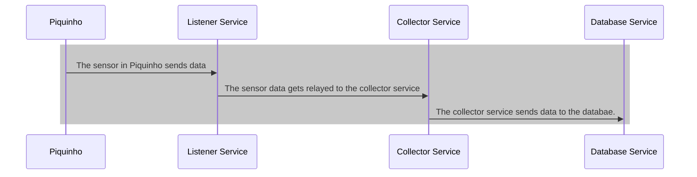

# wild-life-safety-monitor

This repo is meant to be used as a standard repo to understand how Kuma works and how it can be used with an example of
a real world scenario.

## Diagram



```

## Services Description

#### Listener Service

Receives data from sensors and uses an streaming service that receives the data.
This service needs to be able to be very responsive and not consume a lot of resources (reactive)

#### Collector Service

The collector service receives all data from the listener via HTTP and stores it in the database
It needs to do this reliable with multiple checks. It does this asynchronously and rejects requests. It logs the
results.

#### Aggregator Service

This service is responsible to make calculations.
It loops through the database for events and will start asynchronous processes to make calculations and store them in the database.

#### Management Service

The management service deals with the identity of animals and their realtime information
For simplicity, and for this demo, the only CRUD functions it provides is to alter data from the animals and their associated sensors.

#### Graphic User Interface Service.

The GUI will allow realtime view of sensor and calculated data.
It will also allow the editing and change of identifiable animal data.

## K8s Analysis

```shell
kubectl config get-contexts
kubectl config current-context
kubectl config view-context <context-name>
```

```shell
kubectl delete deployment --all
kubectl delete statefulset --all
kubectl delete pod --all
kubectl delete persistentvolume --all
kubectl delete persistentvolumeclaim --all
kubectl delete node --all

```

```shell
kubectl delete service --all
```

```shell
kubectl get pods --all-namespaces
```

## How to start

* Install kubectl, kubeadm, kubelet and kind
* Create cluster

```shell
make install-all
```

* Start registry pods

```shell
make k8s-apply-registry-deployment
make redirect-ports
```

or

```shell
make k8s-init-start
```

* Run all pods

```shell
make k8s-apply-deployment
```

## Commands

#### Establish Mesh Traffic Permissions
```shell
echo "apiVersion: kuma.io/v1alpha1
kind: MeshTrafficPermission
metadata:
  namespace: kuma-system
  name: mtp
spec:
  targetRef:
    kind: Mesh
  from:
    - targetRef:
        kind: Mesh
      default:
        action: Allow" | kubectl apply -f -
```
#### Mutual TLS

```shell
echo "apiVersion: kuma.io/v1alpha1
kind: Mesh
metadata:
  name: default
spec:
  mtls:
    enabledBackend: ca-1
    backends:
    - name: ca-1
      type: builtin" | kubectl apply -f -
```
#### Deny All Traffic

```shell
echo "
apiVersion: kuma.io/v1alpha1
kind: MeshTrafficPermission
metadata:
  namespace: kuma-system
  name: mtp
spec:
  targetRef:
    kind: Mesh
  from:
    - targetRef:
        kind: Mesh
      default:
        action: Deny" | kubectl apply -f -
```

#### Establish allow policy

```shell
echo "
apiVersion: kuma.io/v1alpha1
kind: MeshTrafficPermission
metadata:
  namespace: kuma-system
  name: wlsm-database
spec:       
  targetRef:
    kind: MeshService
    name: wlsm-database-deployment_wlsm-namespace_svc_5432
  from:
    - targetRef:
        kind: MeshService
        name: wlsm-collector-deployment_wlsm-namespace_svc_8081
      default:
        action: Allow" | kubectl apply -f -
```

#### Establish another allow policy

```shell
echo "
apiVersion: kuma.io/v1alpha1
kind: MeshTrafficPermission
metadata:
  namespace: kuma-system
  name: wlsm-collector
spec:       
  targetRef:
    kind: MeshService
    name: wlsm-collector-deployment_wlsm-namespace_svc_8081
  from:
    - targetRef:
        kind: MeshService
        name: wlsm-listener-deployment_wlsm-namespace_svc_8080
      default:
        action: Allow" | kubectl apply -f -
```

#### Establish Fault Injection Policy

```shell
echo "
apiVersion: kuma.io/v1alpha1
kind: MeshFaultInjection
metadata:
  name: default
  namespace: kuma-system
  labels:
    kuma.io/mesh: default
spec:
  targetRef:
    kind: MeshService
    name: wlsm-collector-deployment_wlsm-namespace_svc_8081
  from:
    - targetRef:
        kind: MeshService
        name: wlsm-listener-deployment_wlsm-namespace_svc_8080
      default:
        http:
          - abort:
              httpStatus: 500
              percentage: 50"  | kubectl apply -f -
```

## Fixes

1. Install Docker in Alpine container

```shell
apk add --update docker openrc
service docker start
mkdir /run/openrc
touch /run/openrc/softlevel
```
2. Install Docker in Ubuntu container

```shell
apt-get update
apt-get install ca-certificates curl
install -m 0755 -d /etc/apt/keyrings
curl -fsSL https://download.docker.com/linux/ubuntu/gpg -o /etc/apt/keyrings/docker.asc
chmod a+r /etc/apt/keyrings/docker.asc
echo \
  "deb [arch=$(dpkg --print-architecture) signed-by=/etc/apt/keyrings/docker.asc] https://download.docker.com/linux/ubuntu \
  $(. /etc/os-release && echo "$VERSION_CODENAME") stable" | \
tee /etc/apt/sources.list.d/docker.list > /dev/null
apt-get update
apt-get install docker-ce docker-ce-cli containerd.io docker-buildx-plugin docker-compose-plugin vim
chown root:docker /var/run/docker.sock
```

###### From https://forums.docker.com/t/etc-init-d-docker-62-ulimit-error-setting-limit-invalid-argument-problem/139424:

```text
Line 62 of the /etc/init.d/docker file has "ulimit -Hn 524288". Remove the H.
```

## Resources

- [What is mutual TLS (mTLS)?](https://www.cloudflare.com/learning/access-management/what-is-mutual-tls/)
- [K9s](https://k9scli.io/)
- [North-South traffic](https://www.site24x7.com/it-glossary/north-south-and-east-west-traffic-security-.html)
- [East-West traffic](https://www.site24x7.com/it-glossary/north-south-and-east-west-traffic-security-.html)
- [Getting Started With Kuma Service Mesh](https://konghq.com/blog/engineering/getting-started-kuma-service-mesh)
- [Deploy Kuma on Kubernetes](https://kuma.io/docs/2.6.x/quickstart/kubernetes-demo/)

## About me

[](https://github.com/jesperancinha)
